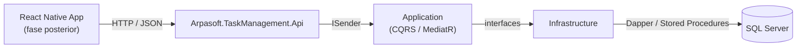
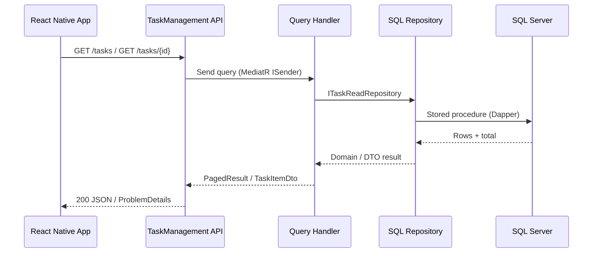
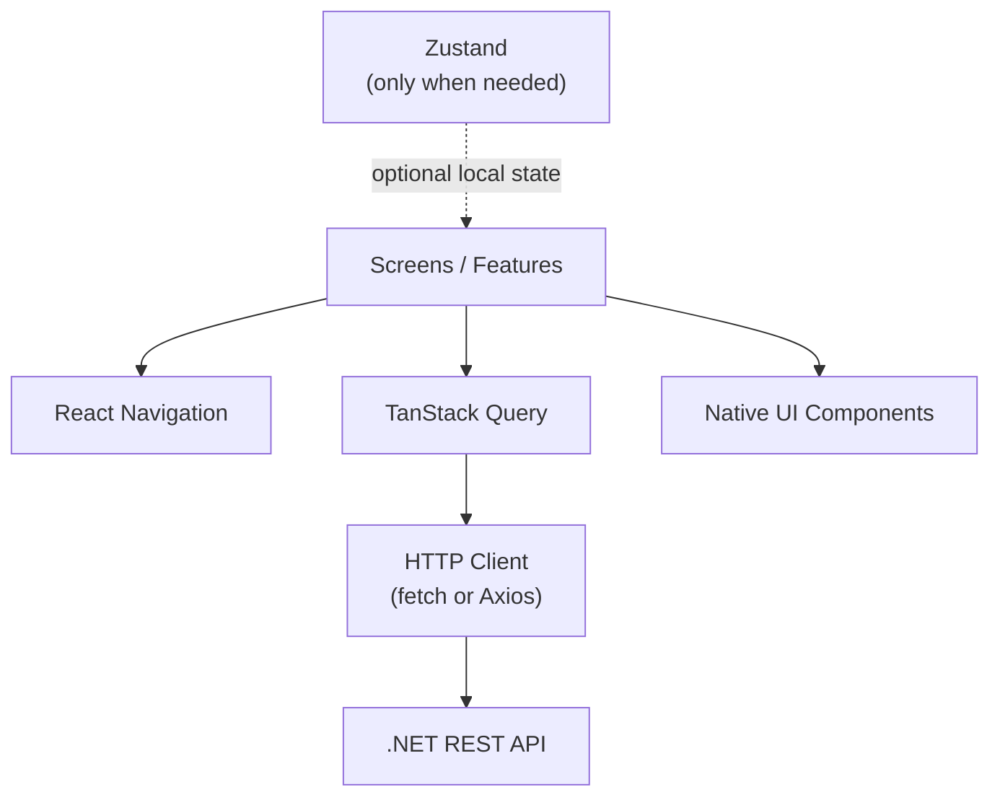
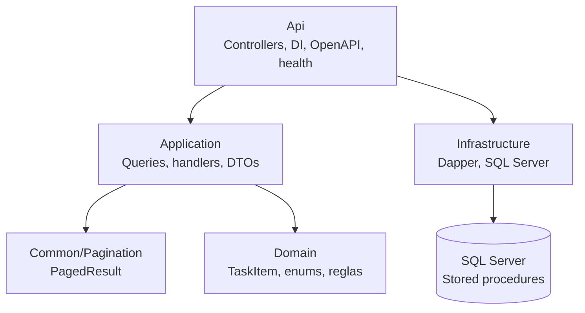

# Architecture

Esta fase implementa únicamente el backend y la base de datos. El backend será un único microservicio REST desplegable como una aplicación ASP.NET Core Web API; no se crearán varios microservicios para este reto.

## Flujo de comunicación





La aplicación mobile consumirá únicamente la API REST. La API coordinará los casos de uso de Application; Infrastructure será la única capa responsable de acceder a SQL Server.

## Arquitectura mobile

La aplicación mobile se implementará como React Native CLI con TypeScript. La arquitectura seguirá una organización por features y mantendrá separadas la navegación, la presentación, el acceso HTTP y el estado remoto.



Decisiones mobile:

- React Native CLI y TypeScript, conforme al enunciado original.
- React Navigation para navegación; no se utilizará React Router, que está orientado a aplicaciones web.
- TanStack Query para estado remoto, cache, loading, errores y refetch de la API.
- Zustand queda disponible para estado local/global que no pertenezca al servidor, pero no se incorporará hasta que exista una necesidad real.
- `lucide-react-native` para iconos.
- Componentes nativos de React Native y estilos propios; no se utilizará un UI Kit.
- `fetch` será suficiente para el cliente HTTP inicial. Axios se considerará solo si aporta una necesidad concreta.
- La aplicación no duplicará reglas de negocio del backend; consumirá el contrato REST documentado.

## Capas del backend



- **Domain**: entidad `TaskItem`, valores controlados y reglas de negocio independientes de frameworks y persistencia.
- **Application**: queries, handlers MediatR, DTOs e interfaces de lectura. Solo depende de Domain y MediatR. La paginación genérica vive en `Common/Pagination` para no acoplarla al caso de uso de tareas.
- **Infrastructure**: implementación de interfaces de Application, conexiones SQL y ejecución de stored procedures mediante Dapper.
- **Api**: HTTP, configuración, inyección de dependencias, OpenAPI, health check y controllers delgados.

## CQRS

El alcance actual es de solo lectura, por lo que se implementan queries sin comandos:

- `GetTasksQuery`: filtra y pagina tareas.
- `GetTaskByIdQuery`: obtiene el detalle de una tarea.

No se incorporan bases de datos separadas, event sourcing, buses de eventos ni abstracciones de CQRS adicionales.

## Contrato funcional

```text
Id: Guid
Title: obligatorio
Description: obligatoria
Priority: Low | Medium | High | Critical
Status: Todo | InProgress | Done
CreatedAt: UTC
```

Los estados y prioridades se serializan como strings sin espacios. Los filtros aceptan varios valores separados por comas.

```http
GET /tasks?page=1&pageSize=20&status=Todo,InProgress&priority=High,Critical
GET /tasks/{id}
```

El listado usa `page=1`, `pageSize=20`, un máximo de `pageSize=100` y orden `Priority DESC, CreatedAt DESC, Id ASC`. La respuesta incluye `items`, `page`, `pageSize`, `totalItems` y `totalPages`.

Los parámetros inválidos producen `400 ProblemDetails`, una tarea inexistente produce `404 ProblemDetails` y un listado sin resultados produce `200` con `items` vacío.

## Decisiones técnicas

- Se utiliza .NET 10 Web API en `src/api/` con el formato `.slnx`.
- Los proyectos usan el prefijo `Arpasoft.TaskManagement`.
- Se utiliza SQL Server con stored procedures.
- Se utiliza Dapper en lugar de Entity Framework.
- Se utiliza MediatR para separar queries y handlers, sin crear comandos que el reto no necesita.
- Los `Guid` se generan en SQL Server con `NEWSEQUENTIALID()` para futuros inserts; el seed usará valores explícitos y reproducibles.
- Las pruebas de integración de Infrastructure usarán Testcontainers para iniciar SQL Server automáticamente cuando Docker Engine esté disponible.
- No se implementan autenticación, multiusuario, CRUD completo, despliegue ni CI/CD en esta fase.
- La futura evolución multiusuario podrá incorporar `OwnerId` sin introducirlo prematuramente en el alcance actual.
- La implementación mobile se mantiene separada del backend y se iniciará después de integrar esta fase en `main`.

## Estructura

```text
src/
├── api/
│   ├── Arpasoft.TaskManagement.slnx
│   ├── Arpasoft.TaskManagement.Domain/
│   ├── Arpasoft.TaskManagement.Application/
│   │   ├── Tasks/
│   │   └── Common/Pagination/PagedResult.cs
│   ├── Arpasoft.TaskManagement.Infrastructure/
│   ├── Arpasoft.TaskManagement.Api/
│   ├── Arpasoft.TaskManagement.Domain.Tests/
│   ├── Arpasoft.TaskManagement.Application.Tests/
│   ├── Arpasoft.TaskManagement.Infrastructure.Tests/
│   └── Arpasoft.TaskManagement.Api.Tests/
└── mobile/ (fase posterior)
```

## Configuración local

La API no crea la base de datos. Requiere una instancia SQL Server accesible, la base `TaskManagement` y los scripts de `database/` ejecutados en orden. La cadena de conexión local debe configurarse con User Secrets o variables de entorno; `appsettings.json` solo conserva un valor de ejemplo. El detalle paso a paso está en `README.md`.

Para desarrollar y ejecutar la aplicación mobile en Android se requiere Node.js/npm, JDK 17 y Android Studio. Android Studio debe tener instalado el Android SDK, una SDK Platform compatible con el template de React Native, Build Tools, Platform-Tools, Emulator y Command-line Tools. También se necesita un Android Virtual Device (AVD).

En Windows, configurar `JAVA_HOME`, `ANDROID_HOME`, `ANDROID_SDK_ROOT` y añadir al `PATH` el JDK, `platform-tools`, `emulator` y `cmdline-tools/latest/bin`. La validación mínima es `java -version`, `adb version` y `emulator -list-avds`. Para iOS se requiere macOS con Xcode.
